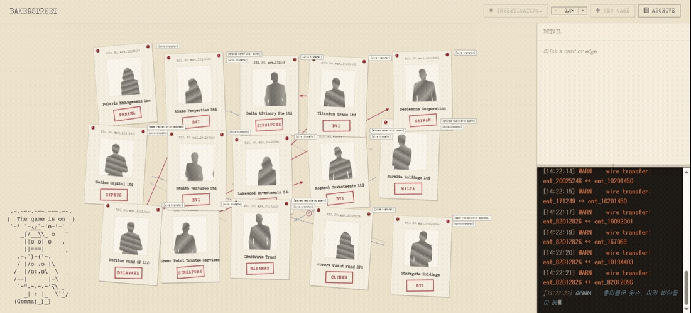

<!-- language switcher -->
[English](README.md) | **한국어**

# BakerStreet: 셸 컴퍼니 수사를 위한 검증 가능한 AI

> LLM의 추론을 **검증 가능한 형태**로 바꾸는 수사 인터페이스입니다. 모델이 내놓는
> 모든 주장은 독립적인 원본 기록으로 역추적되고, 검증을 통과 못 한 주장은
> **화면에서 강등(demote)**됩니다. 국경 간 셸 컴퍼니 / 자금세탁(AML) 분석용으로,
> 주요 비밀 관할(BVI·싱가포르·델라웨어·케이맨·스위스)을 다룹니다.
>
> **LLM은 설명을. 코드는 검증을. 판결은 사람이.**

[](#)
[](#)
[](#)

> **저장소 메모:** 이전엔 *Global Shell-Tracker / Cross-Border Fraud Detection AI*
> 라는 이름으로 공개했습니다. 같은 프로젝트이고 여기선 **BakerStreet**로 소개합니다.

---

## 데모



> 자금 순환과 공유 속성 클러스터가 보드 위에 점화되고, 오른쪽 패널이 한 엣지를
> `FLOW_DIRECTION_MISMATCH`로 표시하며 **강등**합니다. Gemma가 맞는 법인은
> 짚었지만 방향이 반대인 거래를 근거로 댔고, 검증 코드가 그걸 잡아낸 겁니다.

---

## 한눈에

- **작동하는 React 데모**: 의심스러운 셸 컴퍼니, 자금 순환, 공유 속성 클러스터가
  두 개의 시각 레이어로 그려지는 누아르 수사 보드.
- **무엇이 의심스러운지는 LLM이 결정하지 않음.** 결정론적 Pattern Detector(자금
  순환은 DFS, 허브는 연결 수 세기)가 탐지하고, Gemma는 그 결과를 증거 + 셜록 톤
  서사로 *구조화만* 함.
- **모든 주장은 검증됨.** 각 증거는 독립 원본 저장소로의 참조를 들고 있고, 4단계
  검증이 이를 확인하며, 실패하면 화면에서 강등. 데모에선 **16개 관계 중 6개가 강등**됨.
- **판결은 사람이 가짐.** 시스템은 판단을 *제안*하고, 사람이 내리며 OVERRULED로
  뒤집을 수 있음. 이것이 "AI가 그랬다"로는 부족한 자리에서 출력을 쓸 수 있게 함.
- 데모는 더 큰 멀티시그널 설계(문서 + 엔티티 + 관계)의 **관계 레이어**를 구현한
  것이고, 나머지는 설계까지만 돼 있음.

---

## 문제

페이퍼컴퍼니(사무실도 직원도 없이 서류상으로만 존재하는 법인)는 표준적인
자금세탁 수단입니다. 하나만으론 의심하기 어렵습니다. 여러 개가 함께 움직일 때 비로소
패턴이 보입니다: 돈이 **A → B → C → A**로, 우연이라기엔 너무 깔끔하게 한 바퀴 돕니다.

그 패턴을 *탐지*하는 건 대체로 해결된 문제입니다. **설명하는 게 안 됩니다.**
규칙 기반은 분석가를 오탐으로 파묻고, ML 분류기는 정확도는 올려도 *왜* 그렇게
판단했는지 못 보여줍니다. 그리고 "AI가 표시했다"는 법정이나 감사위원회에 가져갈 수
없습니다. 빠진 조각은 탐지가 아니라, **사람이 독립적으로 검증하고 책임질 수 있는
결과**입니다.

---

## 해자(Moat): 기관이 아니라 실무자를 위해

엔터프라이즈 수사 플랫폼(Palantir급)은 이미 이걸 할 수 있지만, 전문 운영자와
기관 라이선스 예산을 전제합니다. 정작 이 구조를 읽어야 할 사람들(컴플라이언스
분석가, 탐사 기자, 주니어 금융정보분석(FIU) 수사관)은 가격과 학습 비용에서
밀려납니다.

BakerStreet의 베팅은 접근성입니다.

- **배울 쿼리 언어가 없음.** 회사·거래 데이터를 주면 시각적이고 검사 가능한
  분석을 돌려줍니다. 먼저 익혀야 할 도구가 없습니다.
- **기본값이 검증 가능.** 보드의 모든 선과 태그는 클릭해 읽을 수 있는 원본
  기록으로 연결됩니다. 블랙박스 점수가 아니라.
- **판결은 사람이 가짐.** 시스템은 증거를 보여주고 판단을 제안하며, 사람이
  결정하고 뒤집을 수 있습니다. 불투명한 위험 점수로는 안 되는 자리에서 출력을
  방어 가능하게 만드는 게 바로 이 점입니다.

---

## 시그널 아키텍처 (전체 시스템)

국경 간 셸 사기는 패턴이 여러 레이어에 분산돼 단일 신호 탐지를 빠져나갑니다.
각각은 따로 보면 정상이지만 합치면 수상합니다. BakerStreet는 모듈형 멀티시그널
파이프라인으로 설계됐습니다. 각 탐지기는 독립적으로 테스트·교체 가능하고,
융합(fusion)은 탐지와 얽히지 않은 별도 레이어로 둡니다.

- **문서 분석** `[설계]`: 금융 문서에서 텍스트·구조 신호를 추출하고, 조작·위조
  정황을 시사하는 어조·서식·메타데이터 이상을 표시.
- **엔티티 검증** `[설계]`: 구조화 소스 간 일관성 검증; 관할이 어긋나는 기록의
  엔티티 해소; 신원 속성·교차 참조 불일치의 위험 신호.
- **관계 모델링** `[구현]`: 법인·계좌·IP 간 연결을 그래프로 표현; 그래프로
  모델링해야만 보이는 간접 연결(자금 순환, 공유 등록 대리인, 공통 명목 이사,
  일치 IP)을 수면 위로.

```
입력 신호
  ├── 문서 이상           [설계]
  ├── 엔티티 불일치       [설계]
  └── 관계 그래프         [구현] ◄── 현재 데모에서 구현된 부분
            │
            ▼
   융합 레이어 (모듈형, 단일 위험 점수 아님)
            │
            ▼
   BakerStreet: 검증 가능한 추론 인터페이스
   (그래프 + 원본 기록 기반 증거 + 사람 판결)
```

핵심 베팅은, 어떤 단일 탐지기가 아니라 **통합**이 기존 도구의 약점이고,
결과만이 아니라 *추론*을 외재화하는 것이 통합 출력을 쓸 만하게 만든다는 것입니다.
아래 관계 레이어가 현재 데모가 종단까지 구현한 부분입니다.

---

## 구현된 파이프라인 동작

```
[Nemotron (표층 레이어만 합성): 이름·주소·메모]
        ▼
[원본 데이터 레이어]  ── 독립적 진실 소스 (읽기 전용)
        ▼
[Pattern Detector]  ── 결정론: 순환(DFS) / 허브(연결 수) / 분산
        ▼
[프리필터]  ── 의심 법인과 관련 기록만 추출
        ▼
[Gemma (구조화 + 서사)]  ── 탐지 안 함; 의심을 구조화만
        ▼
[추론 그래프 레이어]  ◄── 4단계 검증이 일관성 없는 증거를 강등
        ▼
[BakerStreet UI]  ── 흐름·공유속성 레이어 렌더; 판결은 사람이
```

탐지와 구조화를 의도적으로 분리합니다. Pattern Detector가 결정론적으로 의심을
찾고(자금 순환은 **DFS**, 허브는 **각 노드의 연결 수 세기**), 그래서 결과가
재현 가능하고 모델에 의존하지 않습니다. Gemma는 그 결과와 관련 원본 기록을 받아
엣지(`from`, `to`, `type`, `evidences`)를 만들고, 각 증거에 `kind`와 특정 기록
ID로의 `refs`를 붙이며, 셜록 톤의 짧은 서사를 답니다. **모델은 설명을 붙일 뿐,
구조를 결정하지 않습니다.**

---

## 왜 모델 두 개

수업 과제는 Nemotron 또는 Gemma를 쓰는 것이었고, 이 프로젝트는 둘 다 씁니다.
두 작업의 비용 프로필이 정반대이기 때문입니다.

- **Nemotron 3 Super (1200억 파라미터)**: 크고 느리고 비쌈. 그래서 무거운
  *한 번만 돌리는* 작업, 즉 데모 데이터 생성에 씁니다. 실제 유출 데이터(예:
  파나마페이퍼스)는 실명이 박혀 못 쓰니, Nemotron이 비슷한 셸 컴퍼니 *표층*
  데이터(이름·주소·등록 대리인·IP)를 JSON으로 합성합니다. `case_id`를 바꾸면
  다른 사건이 나옵니다: 같은 엔티티 자리가 alpha에선 "Polaris Management",
  bravo에선 "Solaris Ventures", charlie에선 "Zenith Management". 기록 전체의
  일관성은 정확히 작은 모델이 깨지는 지점(다음 줄에서 같은 회사 이름을 또 만듦)인데,
  1200억이면 그게 안 무너졌습니다.
- **Gemma 3n e4b (40억 파라미터)**: 작고 빠르고 NVIDIA NIM에서 무료. 사용자가
  케이스를 열 때마다 돌아야 해서 가벼워야 합니다. (처음엔 Gemma 4 31B를 시도했는데
  NVIDIA 클라우드에서 5분을 넘겨 timeout이 났고, 3n e4b는 ≈90초에 응답해
  안정성 면에서 채택했습니다.)

무거운 일은 큰 모델, 요청마다 도는 일은 작은 모델, 둘 다 NVIDIA 스택이라 묶기도
깔끔합니다. 중요한 건 **표층만 합성**이라는 점: 자금 흐름 패턴 자체는 IBM의 공개
AML 데이터셋 원본 그대로이고, Nemotron은 이름·주소만 그 위에 다시 칠합니다.

---

## 검증 루프

이게 BakerStreet를 일반적인 "설명 가능한 AI"와 가르는 부분입니다. Gemma 출력은
그대로 믿지 않고 코드로 다시 검증합니다. 4단계로.

1. 출력이 기대한 JSON 구조에 맞는가?
2. 각 증거 `ref`가 실제로 존재하는 기록을 가리키는가?
3. 관계 타입이 증거 종류와 일치하는가?
4. **그 기록이 실제로 두 회사를 잇고 있는가?** 가장 강한 검사. Gemma가
   `tx_cycle_03`이 A→B 엣지의 근거라 했는데 실제 `tx_cycle_03`이 B→C 흐름이면
   검증 실패.

실패한 증거는 회색 처리되고 이유 코드와 함께 화면에서 강등됩니다. 녹화된 데모에선
**16개 관계 중 6개가 강등**되며, 대부분 `FLOW_DIRECTION_MISMATCH`: Gemma가 순환의
법인은 맞췄지만 거래-단계 매핑을 한 칸씩 밀어 답한 경우입니다. 사람이 봤으면 놓쳤을
걸 검증 코드가 잡아 화면에 보여준 거죠. 그 눈에 보이는 강등이 데모의 시그니처
순간이자 전체 논지를 한 프레임에 담은 것입니다: **LLM이 환각해도 판결은 안전하다.**

---

## 평가

검증 루프의 결함 탐지 능력을 실제로 측정했습니다. 주장이 아니라 수치로. 뮤테이션
테스트 하네스가 세 케이스(51엣지) 전체에 쓰인 원본 증거에 결함을 주입하고, 4단계
검증이 이를 잡아내는지 확인했습니다.

- **방법**: `verified` 엣지(31개)에만 결함 6종을 시드 고정으로 재현 가능하게
  주입해, 변형 케이스 18개, 총 167개 결함을 만들었습니다.
- **검출률**: 6개 결함 유형(`EDGE_REVERSED`, `GHOST_REF`, `KIND_SWAPPED`,
  `ENDPOINT_SWAPPED`, `REFS_EMPTIED`, `REF_SUBSTITUTED`) 전체에서 100% (167/167).
- **오강등률**: 미변경 엣지에서 0% (0/19).
- **음성 대조군**: 100% 검출률이 하네스 자체의 결함(놓침을 못 세는 채점 버그)이
  아님을 증명하기 위해, 검증기가 구조적으로 잡을 수 없는 결함을 설계했습니다.
  같은 방향으로 흐르는 다른 실제 거래로 인용을 바꿔치기하는 것입니다. 이런 "쌍둥이
  거래"가 현재 데이터셋엔 없어서, 합성으로 하나를 raw_store에 심었더니 검증기는
  이를 `verified`로 통과시켰고, 하네스는 이를 정상적으로 놓침(miss)으로
  집계했습니다. 하네스가 성공만이 아니라 실패도 탐지할 수 있음을 보여줍니다.

**알려진 한계** (다음 백로그):

- 인용 검사는 구조적 지지 여부만 확인하고 의미적 동일성은 검증하지 않습니다.
  같은 방향의 다른 거래로 바꿔치기하면 통과합니다(위 합성 대조군으로 입증).
  현재 데이터셋에선 발생 불가하지만, raw_store가 커지면 실제 사각지대가 됩니다.
- 금액은 대조하지 않습니다. 증거가 금액을 주장하는 구조가 아니라서 금액 변조는
  검증 범위 밖입니다.
- 오강등률 0%는 검증기의 결정론성에 따른 구조적 결과(미변경 엣지는 동일 입력 →
  동일 출력)이지, 새로운 입력에 대한 견고함의 증거는 아닙니다.

---

## 구현됨 vs 설계됨

데모는 실제로 frozen 데이터셋 위에서 종단까지 동작합니다. 더 넓은 멀티시그널
시스템과 실시간 백엔드는 설계는 끝났지만 아직 구현 전입니다. 있는 그대로 적습니다.

### 구현됨 (작동 데모)

| 기능 | 비고 |
|---|---|
| 수사 보드 UI | 셸 컴퍼니 카드 15개, 관할, ASCII 탐정, 수사 로그 |
| 관계 그래프 + 두 레이어 엣지 | `flow`(빨강·방향성) vs `shared_attribute`(점선·잉크블루) |
| 결정론적 탐지 | 순환(DFS), 허브(연결 수), 분산 |
| Nemotron 표층 합성 | 전환 가능한 3케이스: `alpha`/`bravo`/`charlie` |
| Gemma 구조화 | 증거 + `refs` + 셜록 톤 서사 |
| 4단계 검증 + 강등 | 일관성 없는 증거를 이유 코드와 함께 회색 처리 |
| 판결 + 봉인 | AI가 *제안*, 사람이 결정(CONFIRMED/SUSPECTED/HOLD/CLEAN), 불일치 시 `OVERRULED` 도장, 이후 종이 접기 → 봉투 → 도장 → 보관 |

### 설계됨 (다음 단계)

| 기능 | 접근 |
|---|---|
| 문서 이상 신호 레이어 | 텍스트·구조·메타데이터 이상 추출을 같은 그래프로 |
| 엔티티 해소 신호 레이어 | 관할 간 신원 조정 + 위험 속성 |
| 융합 레이어 | 모듈형 신호 결합(균등/학습/규칙 우선; 미해결 질문) |
| 실시간 수사 | FastAPI 백엔드; 콜랩 파이프라인을 `stages/`로 포팅 |
| 스트리밍 UX | SSE `progress`/`edge`/`verdict` 이벤트를 그래프 시퀀서로 |
| 새 케이스 합성 | 사전 빌드 케이스 풀(안전) > 실시간 Nemotron 호출(인상적이지만 timeout 위험) |
| 배포 | Vercel(프론트) + Render/Railway(백엔드), NIM 키는 env로, 절대 커밋 X |

---

## 데모 결과 (frozen 데이터셋)

강등은 결함이 아니라 핵심입니다. 검증 루프가 제 일을 하는 것입니다.

| 케이스 | 관계 수 | 검증됨 | 강등됨 | 주 강등 원인 |
|---|---|---|---|---|
| `alpha` (메인) | 16 | 10 | 6 | `FLOW_DIRECTION_MISMATCH` |
| `bravo` | 17 | 11 | 6 | `FLOW_DIRECTION_MISMATCH` |
| `charlie` | 18 | 10 | 8 | `FLOW_DIRECTION_MISMATCH` |

---

## 정직한 한계

의도적으로 적습니다. 과대광고는 "검증 가능"이라는 전제를 스스로 무너뜨리니까요.

- **브라우저 내 순환 검사는 독립 검증이 아니라 JSON 정합성 검사입니다.** Gemma가
  만든 같은 엣지를 소비하므로, 한 입력에 대한 두 검사는 수학적으로 독립이 아닙니다.
  진짜 독립성은 원본 저장소를 조회하는 증거별 `refs` 검증에 있습니다.
- **합성 데이터는 구조를 부여할 뿐 통계적 충실성을 주장하지 않습니다.** 분포는
  IBM AML / SAML-D의 주변 분포를 따르고 엔티티 구조는 실제 ICIJ 유출 사례를
  참조하지만, 패턴은 명시적 제약으로 부여되며 케이스별 사실 정확성은 주장하지 않습니다.
- **데모는 frozen입니다.** 사용자 입력(케이스·판결·메모)은 아직 분석을 바꾸지
  않습니다. 실시간화가 다음 마일스톤이지 숨은 기능이 아닙니다.

---

## 미해결 질문

아직 다듬는 중:

- 융합 레이어 가중 전략: 균등 / 학습 / 규칙 우선
- 신호가 하나둘만 켜질 때의 신뢰도 보정
- 관계 레이어의 그래프 탐색 깊이 제한 (오탐 트레이드오프)
- 법인 10개 이상 케이스의 레이아웃·애니메이션 타이밍
- 차수(degree)가 동률일 때 파생 상태(상위 계좌·허브 노드)의 타이브레이킹

---

## 기술 스택

| 레이어 | 기술 |
|---|---|
| 합성 데이터 시드 | IBM AML-Data (Kaggle), ICIJ Offshore Leaks |
| 표층 합성 | Nemotron 3 Super 120B (NVIDIA NIM) |
| 구조화 LLM | Gemma 3n e4b 4B (NVIDIA NIM) |
| 탐지 | 결정론 Python: DFS(순환), degree(허브), 분산 |
| 코어 파이프라인 | Python |
| 인터페이스 | React + TypeScript + Zustand + SVG + Framer Motion + Canvas 2D |

---

## 관련 프로젝트

*비구조 신호 → 구조화 기록 → 이상 탐지* 라는 같은 패턴을 여러 금융 도메인에 적용:

> **[Dandi](https://github.com/si3ae/Dandi)**: 현금 비중이 큰 소상공인을 위한
> 시민 단위 금융 AI; 작동 프로토타입 출시; 같은 이상 탐지 패턴
> (기준선 → 편차 → 경보 → 근거)
>
> **[Financial Intelligence Terminal](https://github.com/si3ae/Financial_Intelligence_Terminal)**:
> 대규모 멀티에셋 시장 신호 집계

---

## 만든 사람

홍신애(Sinae Hong).

WorldQuant Brain 컨설턴트 티어(퀀트 경험 0에서 집중적인 일일 알파 제출을 통해
컨설턴트 티어 도달). 최근 컴퓨터공학으로 전향했습니다.
BakerStreet의 AML·금융 도메인 엄밀함은 이 배경에서 나왔고, 엔지니어링 실행은
만들면서 병행해 익혔습니다.

[LinkedIn](https://www.linkedin.com/in/sinae-hong-583306216/)
